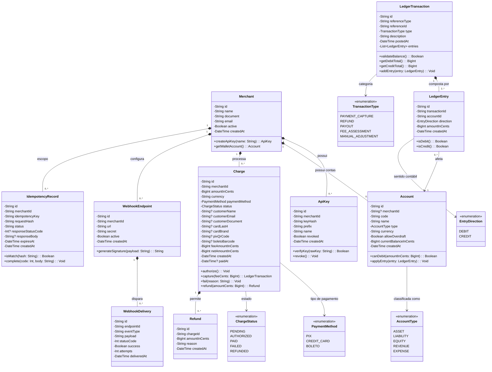
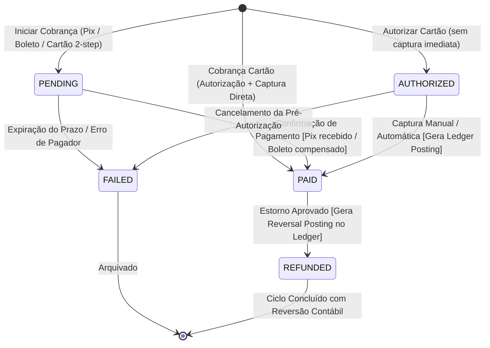
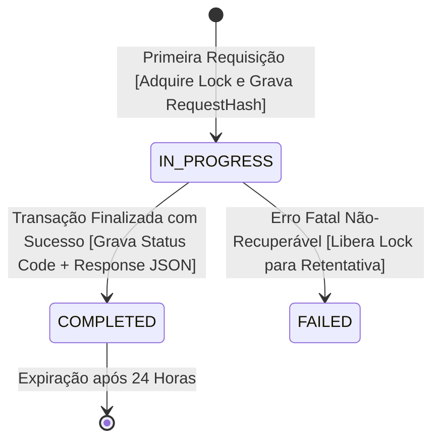
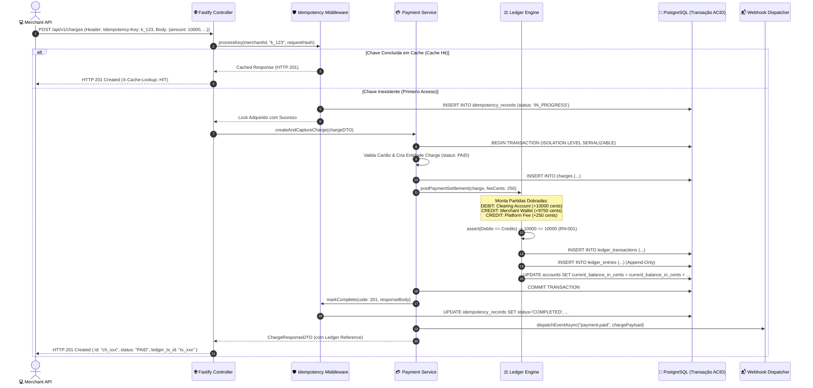

# 📐 Modelagem Estrutural & Comportamental (UML 2.5)

**Projeto:** PayFlow Core - Gateway de Pagamentos e Ledger Financeiro Imutável  
**Referência SRS:** `thoughts/shared/requirements/2026-10-06-srs-specification.md`  
**Analista de Sistemas:** `systems_analyst`  
**Data:** 2026-10-06  
**Versão:** 1.0.0  

---

## 🏗️ 1. Diagrama de Classes UML (Modelo Estrutural de Domínio)

---

## 🔄 2. Diagramas de Máquinas de Estado (Statecharts)

### 2.1 Ciclo de Vida da Cobrança (`Charge`)

### 2.2 Ciclo de Vida do Registro de Idempotência (`IdempotencyRecord`)

---

## ⚡ 3. Diagrama de Sequência de Sistema (SSD — Captura e Ledger Atômico)

