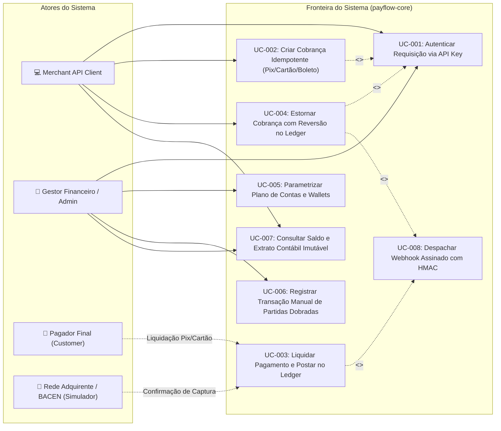

# 👥 Especificação de Casos de Uso (UML 2.5 Use Cases)

**Projeto:** PayFlow Core - Gateway de Pagamentos e Ledger Financeiro Imutável  
**Referência SRS:** `thoughts/shared/requirements/2026-10-06-srs-specification.md`  
**Analista de Sistemas:** `systems_analyst`  
**Data:** 2026-10-06  
**Versão:** 1.0.0  

---

## 🗺️ 1. Diagrama Geral de Casos de Uso (UML 2.5)

---

## 📝 2. Especificação Detalhada de Casos de Uso Críticos

---

### Caso de Uso: `UC-002 — Criar Cobrança Idempotente`

- **Identificador:** UC-002
- **Requisitos Associados:** RF-001, RF-002, RF-003, RF-004, RF-005, RNF-001, RNF-003, RNF-005
- **Regras de Negócio Vinculadas:** RN-003 (Idempotência por Chave e Hash), RN-006 (Consistência de Moeda)
- **Ator Primário:** Merchant API Client
- **Pré-condições:**
  1. O Merchant deve possuir uma API Key ativa e passar autenticação Bearer (UC-001).
  2. O cabeçalho `Idempotency-Key` deve estar presente na requisição HTTP.
- **Pós-condições:**
  1. Registro de `Charge` criado com status correspondente (`PENDING` para Pix/Boleto, ou `PAID` para Cartão capturado).
  2. Chave de idempotência gravada com hash SHA-256 e resposta em cache por 24 horas.

#### Fluxo Principal (Happy Path — Cobrança Cartão com Captura Imediata):
1. O Merchant envia `POST /api/v1/charges` com header `Idempotency-Key: uuid-v4` e payload contendo valor em centavos (`amount_in_cents: 15000`), moeda (`BRL`), método (`CREDIT_CARD`), dados do cartão e do cliente.
2. O sistema calcula o hash SHA-256 do payload JSON recebido.
3. O sistema consulta a tabela de idempotência para o `merchant_id` e a chave informada.
4. Nenhuma chave anterior é encontrada; o sistema adquire lock transacional para a chave em status `IN_PROGRESS`.
5. O sistema valida os campos via schema Zod e valida o número do cartão pelo algoritmo de Luhn e validade.
6. O sistema executa o fluxo de autorização e captura.
7. A cobrança é persistida com status `PAID` e dados sensíveis mascarados (`last4`, bandeira).
8. O sistema dispara a liquidação contábil imediata no Ledger (UC-003).
9. O sistema salva a resposta completa e status HTTP 201 no registro de idempotência.
10. O sistema retorna `HTTP 201 Created` contendo o ID da cobrança, status `PAID`, recibo e detalhes contábeis.

#### Fluxos Alternativos:
- **FA-01: Replay Idempotente de Requisição (Cache Hit):**
  1. No passo 3, o sistema localiza a chave de idempotência já finalizada no banco para o mesmo merchant.
  2. O sistema compara o hash SHA-256 armazenado com o hash da requisição atual.
  3. Os hashes são idênticos.
  4. O sistema não reprocessa pagamento nem afeta o ledger; recupera a resposta gravada no cache.
  5. O sistema retorna o status original com o header `X-Cache-Lookup: HIT` e o mesmo corpo JSON.
- **FA-02: Cobrança Pix:**
  1. No passo 1, o método informado é `PIX`.
  2. O sistema valida os dados do pagador e gera payload copia-e-cola no padrão EMV e expiração padrão (30 min).
  3. O status inicial é persistido como `PENDING`.
  4. O sistema retorna `HTTP 201 Created` contendo o código Pix copia-e-cola e chave.

#### Fluxos de Exceção:
- **FE-01: Mismatch de Payload na Mesma Chave de Idempotência (RN-003):**
  1. No passo 3, a chave de idempotência existe para o mesmo merchant, mas os dados do payload são diferentes (hash diverge).
  2. O sistema aborta o processamento imediatamente.
  3. O sistema retorna `HTTP 409 Conflict` com código `IDEMPOTENCY_PAYLOAD_MISMATCH` e mensagem: *"Uma requisição anterior utilizou a mesma Idempotency-Key com parâmetros distintos."*
- **FE-02: Concorrência Simultânea na Mesma Chave:**
  1. No passo 4, outra thread ou nó já está processando a mesma chave (status `IN_PROGRESS`).
  2. O sistema rejeita a chamada concorrente com `HTTP 429 Too Many Requests` ou `HTTP 409 Conflict` instruindo retentativa após alguns segundos.

---

### Caso de Uso: `UC-003 — Liquidar Pagamento e Postar no Ledger`

- **Identificador:** UC-003
- **Requisitos Associados:** RF-006, RF-009, RNF-002, RNF-004, RNF-005
- **Regras de Negócio Vinculadas:** RN-001 (Invariante Contábil), RN-002 (Imutabilidade do Ledger), RN-006 (Consistência de Moeda)
- **Ator Primário:** Sistema Interno (Engine de Pagamentos)
- **Pré-condições:**
  1. A cobrança existe e teve confirmação de pagamento.
  2. As contas contábeis do Merchant e da Plataforma estão configuradas.
- **Pós-condições:**
  1. Status da cobrança atualizado para `PAID` com timestamp de pagamento.
  2. `LedgerTransaction` gerada contendo os lançamentos de débito e crédito balanceados:
     - DÉBITO: Conta de Gateway / Clearing (Ativo) no valor integral.
     - CRÉDITO: Conta do Merchant Wallet (Passivo) no valor líquido (após taxa).
     - CRÉDITO: Conta de Receita de Taxas da Plataforma (Receita) no valor da taxa (*fee*).
  3. $\sum \text{Débitos} = \sum \text{Créditos}$ estritamente preservado.
  4. Evento `payment.paid` enfileirado para webhook (UC-008).

#### Fluxo Principal (Happy Path):
1. O evento de pagamento é recebido com o identificador da cobrança.
2. O sistema inicia transação de banco com isolamento serializável/ACID.
3. O sistema bloqueia a linha da cobrança para leitura com lock pessimista.
4. O sistema calcula a taxa de transação (ex: 2.5% ou tarifa fixa).
5. O sistema obtém as contas contábeis envolvidas:
   - `ACCOUNT_CLEARING` (Ativo da Plataforma)
   - `ACCOUNT_MERCHANT_WALLET` (Passivo / Obrigação com o Merchant)
   - `ACCOUNT_PLATFORM_REVENUE` (Receita Operacional da Plataforma)
6. O sistema monta a `LedgerTransaction` e suas `LedgerEntry`s:
   - Entry 1: Débito em `ACCOUNT_CLEARING` por R$ 100,00 (10000 cents).
   - Entry 2: Crédito em `ACCOUNT_MERCHANT_WALLET` por R$ 97,50 (9750 cents).
   - Entry 3: Crédito em `ACCOUNT_PLATFORM_REVENUE` por R$ 2,50 (250 cents).
7. O sistema aplica a asserção matemática inegociável da RN-001:
   $$\text{Débitos} = 10000 \quad == \quad \text{Créditos} = 9750 + 250 = 10000$$
8. A validação é verdadeira ($10000 == 10000$, diferença = 0).
9. O sistema persiste a transação e as entradas como append-only imutável (RN-002).
10. O sistema incrementa os saldos consolidados das contas e atualiza a cobrança para `PAID`.
11. O sistema faz commit da transação ACID.
12. O sistema despacha o evento assinado `payment.paid` para o webhook (UC-008).

#### Fluxos de Exceção:
- **FE-01: Desbalanceamento de Partidas Dobradas (Violação de RN-001):**
  1. No passo 7, ocorre arredondamento incorreto na lógica e o total de débitos diverge dos créditos por 1 centavo sequer.
  2. A asserção de domínio falha emitindo `UnbalancedLedgerException`.
  3. A transação do banco sofre rollback imediato.
  4. Um alerta de erro crítico é emitido no log estruturado e nenhum saldo é modificado.

---

### Caso de Uso: `UC-004 — Estornar Cobrança com Reversão no Ledger`

- **Identificador:** UC-004
- **Requisitos Associados:** RF-007, RF-009, RF-010, RNF-002, RNF-004
- **Regras de Negócio Vinculadas:** RN-001, RN-002, RN-004, RN-005 (Limite Acumulado de Estorno)
- **Ator Primário:** Merchant API Client ou Gestor Financeiro
- **Pré-condições:**
  1. Cobrança deve estar com status `PAID`.
  2. O merchant deve possuir saldo suficiente na carteira para cobrir o estorno (RN-004).
- **Pós-condições:**
  1. Registro de `Refund` gravado com valor, motivo e ID único.
  2. Nova transação contábil compensatória (`REVERSAL`) gravada no Ledger invertendo as posições de débito e crédito proporcionalmente.
  3. Status da cobrança atualizado para `REFUNDED` (estorno total) ou `PARTIALLY_REFUNDED`.

#### Fluxo de Exceção:
- **FE-01: Estorno Excede Saldo Original (Violação RN-005):**
  1. O usuário tenta estornar R$ 60,00 de uma cobrança de R$ 100,00 que já possui R$ 50,00 previamente estornados.
  2. O somatório pretendido (R$ 110,00) excede o valor original (R$ 100,00).
  3. O sistema rejeita com `HTTP 422 Unprocessable Entity` com código `REFUND_EXCEEDS_CHARGE_AMOUNT`.
