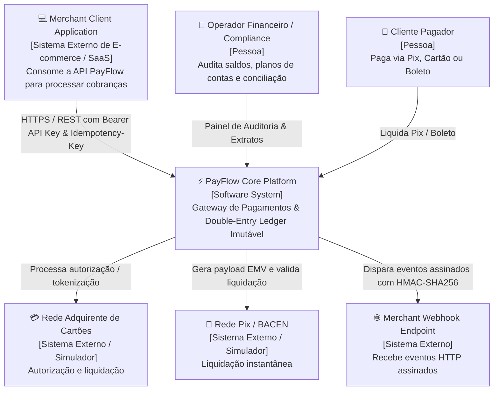

# 🏛️ PayFlow Core — Documento de Arquitetura de Sistema (C4 Model)

- **Documento:** `thoughts/shared/architecture/2026-10-06-payflow-core-architecture.md`
- **Arquiteto Responsável:** `system_architect`
- **Data de Aprovação:** 2026-10-06
- **Versão:** 1.0.0
- **Status:** Proposto / Submetido ao Gate 1

---

## 1. Visão Geral do Sistema & Bounded Contexts

O **PayFlow Core** é a espinha dorsal de transações financeiras e controle contábil da organização. Ele é projetado sob os preceitos de Arquitetura Limpa / Hexagonal, separando rigorosamente:
1. **Contexto de Gateway de Pagamentos (`PaymentContext`):** Orquestração de cobranças (Pix, Boleto, Cartão), validação de bandeira, geração de QR codes e ciclo de vida (`PENDING`, `AUTHORIZED`, `PAID`, `REFUNDED`).
2. **Contexto de Idempotência (`IdempotencyContext`):** Garantia determinística de execução única com hash SHA-256 e cache de resposta para mitigação de double-charge em cenários distribuídos.
3. **Contexto de Double-Entry Ledger (`LedgerContext`):** Livro-razão contábil de partidas dobradas estritamente append-only (imutável), garantindo a asserção matemática $\sum \text{Débitos} = \sum \text{Créditos}$ em todas as operações com isolamento ACID serializável.
4. **Contexto de Notificações & Webhooks (`WebhookContext`):** Despacho assíncrono de eventos assinados com HMAC-SHA256 (`X-Payflow-Signature`) e retentativa exponencial.

---

## 2. Nível 1: Diagrama de Contexto do Sistema (System Context)



---

## 3. Nível 2: Diagrama de Contêineres (Containers)

```mermaid
graph TD
    Client["🖥️ Merchant API Clients & Dashboard<br/>[HTTPS / REST / JSON]<br/>Integração com headers de autenticação e idempotência"]
    
    subgraph PayFlowHost["PayFlow Core Container (Docker Multi-Stage)"]
        API["⚙️ Fastify API Server<br/>[TypeScript / Bun Runtime]<br/>Roteamento de alta vazão, validação Zod e middlewares"]
        IdempEngine["🛡️ In-Memory / Distributed Idempotency Lock<br/>[Idempotency Store]<br/>Deduplicação de requisições por hash SHA-256"]
        LedgerEngine["⚖️ Double-Entry Ledger Core<br/>[TypeScript Domain Core]<br/>Validação estrita de partidas dobradas e append-only"]
        WebhookDispatcher["📬 Asynchronous Webhook Dispatcher<br/>[Event Emitter / Queue]<br/>Cálculo de assinatura HMAC-SHA256 e entrega HTTP"]
    end
    
    DB[("💾 Relational Database<br/>[PostgreSQL / SQLite ACID]<br/>Persistência com locks transacionais serializáveis")]

    Client -->|POST /api/v1/charges| API
    API --> IdempEngine
    API --> LedgerEngine
    API --> WebhookDispatcher
    
    IdempEngine -->|Lock & Cache| DB
    LedgerEngine -->|Transações ACID (Debit=Credit)| DB
    WebhookDispatcher -->|Log de entregas e retries| DB
```

### Inventário de Contêineres:
| Contêiner | Tecnologia | Responsabilidade | Protocolo |
| :--- | :--- | :--- | :--- |
| **PayFlow API Service** | Fastify 4 / TypeScript / Bun | Exposição das rotas REST, autenticação por API Key, validação Zod | HTTP / JSON |
| **Ledger Core Engine** | TypeScript Domain Layer | Garantia de invariante contábil, imutabilidade append-only e cálculo de saldos | In-process / ACID |
| **Banco Relacional** | SQLite (dev/test) / PostgreSQL (prod) | Armazenamento de charges, accounts, ledger_transactions e ledger_entries | SQL / Prisma / ACID |

---

## 4. Nível 3: Diagrama de Componentes (Components)

```mermaid
graph TD
    subgraph PresentationLayer["Presentation Layer (HTTP)"]
        ChargeController["Charges Controller<br/>POST /api/v1/charges<br/>GET /api/v1/charges/:id"]
        LedgerController["Ledger Controller<br/>GET /api/v1/accounts/:id/balance<br/>GET /api/v1/accounts/:id/statement<br/>POST /api/v1/ledger/transactions"]
        HealthController["Health Controller<br/>GET /health/liveness<br/>GET /health/readiness"]
        IdempMiddleware["Idempotency Middleware<br/>Header Idempotency-Key validation"]
        AuthMiddleware["Auth Middleware<br/>Bearer API Key SHA-256 hash validation"]
    end

    subgraph ApplicationLayer["Application Layer (Use Cases)"]
        CreateChargeUseCase["CreateChargeUseCase<br/>Valida método, cria cobrança e captura"]
        RefundChargeUseCase["RefundChargeUseCase<br/>Valida limite e reverte contabilidade"]
        PostLedgerTransactionUseCase["PostLedgerTransactionUseCase<br/>Assegura partidas dobradas atômicas"]
        GetAccountBalanceUseCase["GetAccountBalanceUseCase<br/>Calcula saldo consolidado da conta"]
    end

    subgraph DomainLayer["Domain Layer (Entities & Rules)"]
        MoneyVO["Money Value Object<br/>Representação estrita em centavos (Minor Units)"]
        LedgerTxEntity["LedgerTransaction Entity<br/>Invariante Debit == Credit (RN-001)"]
        ChargeEntity["Charge Entity<br/>Máquina de estados de pagamento"]
        AccountEntity["Account Entity<br/>Validação de saldo e tipo (RN-004)"]
    end

    subgraph InfrastructureLayer["Infrastructure Layer (Persistence & Adapters)"]
        PrismaDbAdapter["Database Adapter / Prisma Client<br/>Transações serializáveis e locks pessimistas"]
        HmacSignatureService["HMAC-SHA256 Signer<br/>Assinatura de payloads de webhook"]
    end

    ChargeController --> AuthMiddleware
    ChargeController --> IdempMiddleware
    ChargeController --> CreateChargeUseCase
    ChargeController --> RefundChargeUseCase
    
    LedgerController --> AuthMiddleware
    LedgerController --> PostLedgerTransactionUseCase
    LedgerController --> GetAccountBalanceUseCase
    
    CreateChargeUseCase --> ChargeEntity
    CreateChargeUseCase --> LedgerTxEntity
    CreateChargeUseCase --> MoneyVO
    CreateChargeUseCase --> PrismaDbAdapter
    
    PostLedgerTransactionUseCase --> LedgerTxEntity
    PostLedgerTransactionUseCase --> AccountEntity
    PostLedgerTransactionUseCase --> PrismaDbAdapter
```



---

## 5. Diretrizes Transversais (Cross-Cutting Concerns)

### 5.1 Segurança & Integridade de Chaves
- API Keys possuem prefixo visível (ex: `pk_live_...` ou `sk_live_...`) e somente o hash criptográfico **SHA-256** é armazenado no banco de dados.
- O payload de webhook é assinado com chave secreta dedicada do merchant via HMAC-SHA256 (`X-Payflow-Signature`).

### 5.2 Resiliência de Idempotência & Concorrência
- Qualquer requisição financeira mutativa que envie `Idempotency-Key` adquire um lock transacional.
- Se o hash do corpo bater, a resposta serializada em JSON é retornada diretamente (`X-Cache-Lookup: HIT`).
- Se o hash divergir, `HTTP 409 Conflict (IDEMPOTENCY_PAYLOAD_MISMATCH)` é disparado.

### 5.3 Zero Floating Point Math
- **Regra de Ouro:** NENHUM valor monetário transita ou é calculado como `float` ou `double`.
- Todos os campos são inteiros (`BigInt` ou `Int` de centavos: `amount_in_cents`). R$ 10,50 = `1050`.
