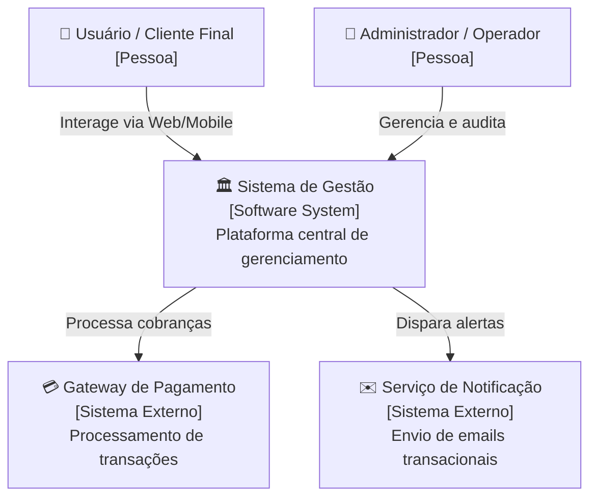
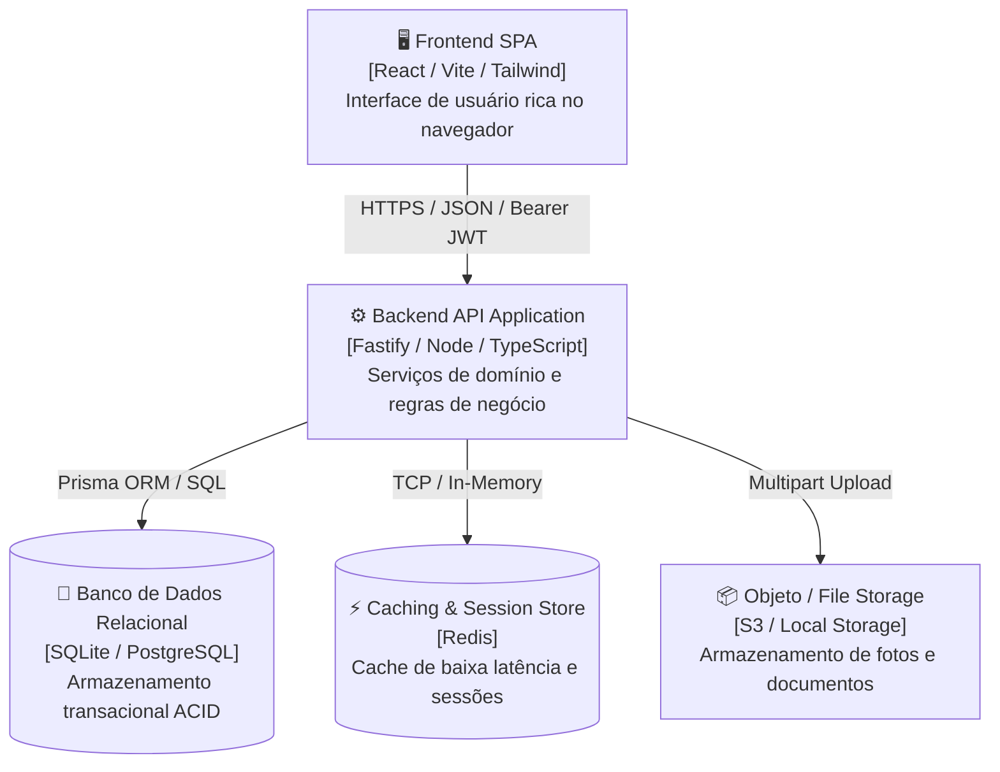
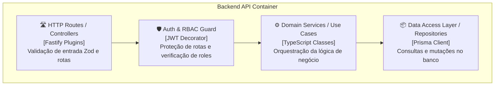

# [Nome do Sistema / Módulo] — Documento de Arquitetura de Sistema (C4 Model)

- **Documento:** `thoughts/shared/architecture/YYYY-MM-DD-nome-do-sistema.md`
- **Arquiteto Responsável:** System Architect Agent
- **Data de Aprovação:** YYYY-MM-DD
- **Versão:** 1.0.0
- **Status:** Rascunho | Aprovado | Em Evolução

---

## 1. Visão Geral do Sistema & Domínio

[Descreva brevemente o propósito do sistema, os objetivos de negócio atendidos e os principais limites do domínio (Bounded Contexts).]

---

## 2. Nível 1: Diagrama de Contexto do Sistema (System Context)

Mostra como o sistema se encaixa no ambiente geral, incluindo os usuários humanos e os sistemas externos com os quais interage.

---

## 3. Nível 2: Diagrama de Contêineres (Containers)

Descreve as aplicações de software autônomas, bancos de dados, storages, mensagerias e gateways que compõem o sistema.

### Inventário de Contêineres:
| Contêiner | Tecnologia | Responsabilidade | Protocolo de Comunicação |
| :--- | :--- | :--- | :--- |
| **Frontend SPA** | React 18, TanStack Query | Renderização de telas e validação cliente | HTTPS / REST / SSE |
| **Backend API** | Fastify 4, TypeScript | Execução das regras de negócio e autenticação | HTTP / JSON |
| **Banco de Dados** | SQLite / PostgreSQL | Persistência transacional dos dados | Driver Nativo / ORM |

---

## 4. Nível 3: Diagrama de Componentes (Components)

Decompõe os contêineres principais em seus módulos lógicos internos, camadas arquiteturais e fronteiras de domínio.

---

## 5. Nível 4: Código & Contratos Canônicos (Code & Data Model)

Referência aos artefatos formais versionados no repositório:
* **Modelagem Relacional:** `thoughts/shared/contracts/schema.prisma` (ou `server/prisma/schema.prisma`).
* **Contrato de API REST:** `thoughts/shared/contracts/openapi.yaml`.
* **Schemas de Validação:** Zod schemas localizados nos respectivos módulos de domínio.

---

## 6. Diretrizes Transversais (Cross-Cutting Concerns)

### 6.1 Segurança & Autorização
- **Autenticação:** Stateless Bearer Token via JWT.
- **Autorização:** Role-Based Access Control (RBAC) com roles definidas explicitamente nos decoradores de rota.

### 6.2 Resiliência & Tratamento de Falhas
- **Timeouts & Retries:** Limite de 5s para integrações externas com backoff exponencial.
- **Transacionalidade:** Operações em múltiplos agregados devem utilizar transações atômicas no banco de dados.

### 6.3 Observabilidade & Auditoria
- **Logging Estruturado:** JSON unificado via Pino com `reqId` rastreável de ponta a ponta.
- **Histórico de Auditoria:** Mutações críticas em entidades principais gravam logs cronológicos imutáveis.
