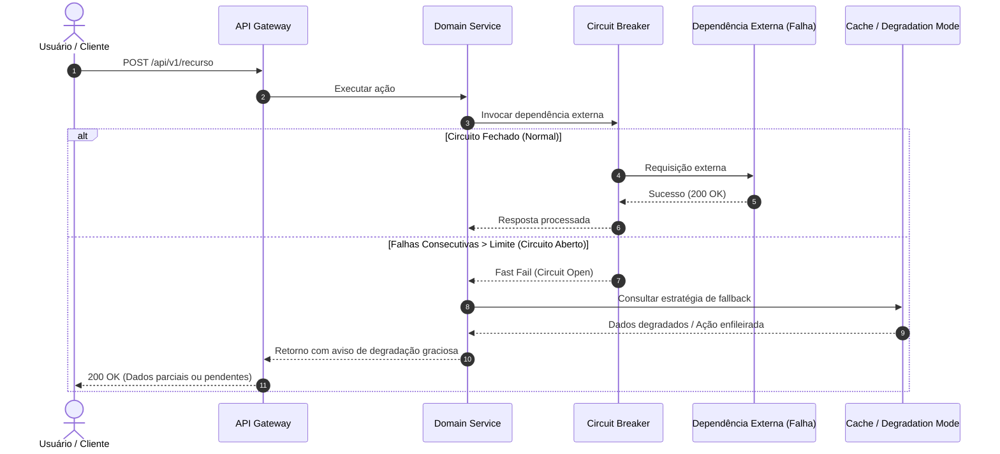

# 💥 Simulação de Falhas, Engenharia de Caos & Resiliência

- **Sistema / Subsistema:** `<SERVICE_NAME>`
- **Data da Simulação:** `YYYY-MM-DD`
- **Arquiteto Responsável:** System Architect
- **Objetivos de Negócio:** RPO = `<ex: 0 (Zero Data Loss)>` | RTO = `<ex: < 60 segundos>`

---

## 1. Matriz de Simulação de Falhas e Blast Radius (Raio de Destruição)

| Componente Afetado | Hipótese de Falha Injetada | Blast Radius (Impacto no Usuário) | Mecanismo de Tolerância Ativo | Comportamento Observado |
| :--- | :--- | :--- | :--- | :--- |
| **Banco de Dados Principal** | Queda abrupta / Conexão recusada | Criação e edição de dados bloqueadas | Health check falha ➔ Retorna HTTP 503 com retry-after | Leituras em cache continuam servindo; sem perda de dados commited |
| **Broker de Eventos (Redis/Kafka)** | Partição de rede / Fila inacessível | Despacho de mensagens assíncronas falha | **Outbox Pattern** na mesma transação SQL local | Eventos ficam retidos no banco e são despachados quando broker reestabelecer |
| **Provedor de LLM / AI Gateway** | Rate limit HTTP 429 ou Timeout > 15s | Assistente inteligente inacessível | **Fallback Chain:** Tenta modelo secundário (Gemini ➔ Claude) ➔ Erro amigável | Usuário recebe resposta alternativa ou mensagem de degradação graciosa |
| **Serviço de Autenticação / JWT** | Chave pública de verificação indisponível | Falha na validação de novos tokens | Cache local de chaves JWKS com TTL de 24 horas | Sessões ativas continuam operando normalmente sem interrupção |

---

## 2. Diagrama de Comportamento sob Falha (Circuit Breaker & Fallback)

---

## 3. Política de Recuperação Pós-Incidente (Self-Healing)

1. **Retries com Jitter:** Chamadas de rede utilizam algoritmo Exponential Backoff com jitter aleatório para evitar *thundering herd problem*.
2. **Dead Letter Queue (DLQ):** Mensagens com mais de 3 falhas de processamento são movidas para DLQ para auditoria humana sem travar a fila principal.
3. **Graceful Shutdown:** Ao receber sinal `SIGTERM`, os serviços param de aceitar novas requisições, aguardam até 10 segundos para encerrar conexões ativas e fecham o pool de banco com segurança.
