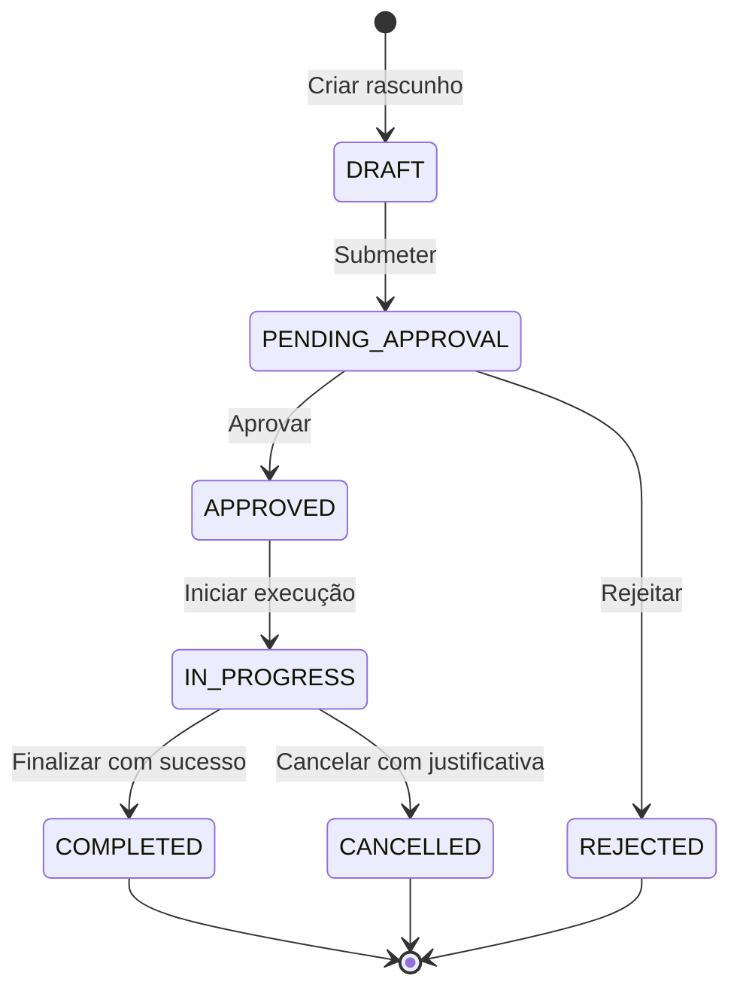

# 📊 Domain Data & Entity Integrity Contract: <ENTITY_NAME>

- **Bounded Context:** `<BOUNDED_CONTEXT>`
- **Aggregate Root:** `<AGGREGATE_ROOT>`
- **Persistence Target:** `<SQL_DATABASE_TABLE_OR_COLLECTION>`
- **Owner Subsystem:** `<SERVICE_NAME>`
- **Last Updated:** `YYYY-MM-DD`
- **Governing ADR:** `thoughts/shared/architecture/adr/YYYY-MM-DD-ADR-XXX-<name>.md`

---

## 1. Schema & Column Specifications

| Campo | Tipo Físico | Nulável | Chave / Índice | Regra de Domínio / Validação |
| :--- | :--- | :--- | :--- | :--- |
| `id` | `VARCHAR(36)` / `UUID` | Não | PK Clustered | Identificador único gerado na aplicação (ULID / UUIDv7). |
| `tenant_id` | `VARCHAR(36)` | Não | INDEX | Isolamento multi-tenant obrigatório em todas as queries. |
| `status` | `VARCHAR(30)` | Não | INDEX | Enum de status controlado pela máquina de estados. |
| `version` | `INTEGER` | Não | - | Concorrência otimista (incrementado em cada update). |
| `created_at` | `TIMESTAMP` | Não | - | Imutável (persistido na criação). |
| `updated_at` | `TIMESTAMP` | Não | - | Atualizado automaticamente via trigger ou ORM. |
| `deleted_at` | `TIMESTAMP` | Sim | INDEX | Soft-delete (nulo para registros ativos). |

---

## 2. Invariantes de Negócio (Regras Inegociáveis)

1. **Invariante 1 (Unicidade e Integridade):**
   - `<Ex: Não pode existir mais de um registro ativo com o mesmo documento/código no mesmo tenant>`.
2. **Invariante 2 (Transições e Concorrência):**
   - `<Ex: A atualização de status exige conferência do campo 'version' para prevenir lost-updates>`.
3. **Invariante 3 (Totais e Cálculos Financeiros):**
   - `<Ex: O valor total deve corresponder estritamente à soma dos itens filhos menos descontos aplicados>`.

---

## 3. Máquina de Estados da Entidade (State Transitions)

### Matriz de Transições Permitidas

| De (Origem) | Para (Destino) | Disparador (Actor / Evento) | Pré-requisitos & Validações |
| :--- | :--- | :--- | :--- |
| `DRAFT` | `PENDING_APPROVAL` | Usuário criador | Todos os campos obrigatórios preenchidos. |
| `PENDING_APPROVAL` | `APPROVED` | Gestor / Auditor | Permissão RBAC `MANAGER`. |
| `IN_PROGRESS` | `COMPLETED` | Técnico / Executor | Checklist 100% preenchido. |

---

## 4. Política de Auditoria e Rastreabilidade

- **Audit Trail:** Cada alteração nos campos críticos gera um snapshot na tabela de log histórico (`<ENTITY>_audit_log`).
- **Idempotência:** Ações de mutação aceitam cabeçalho `Idempotency-Key` com TTL de 24 horas no Redis.
- **Tenancy Enforcement:** Nenhuma query SELECT, UPDATE ou DELETE pode ser executada sem a cláusula WHERE `tenant_id = :current_tenant`.
