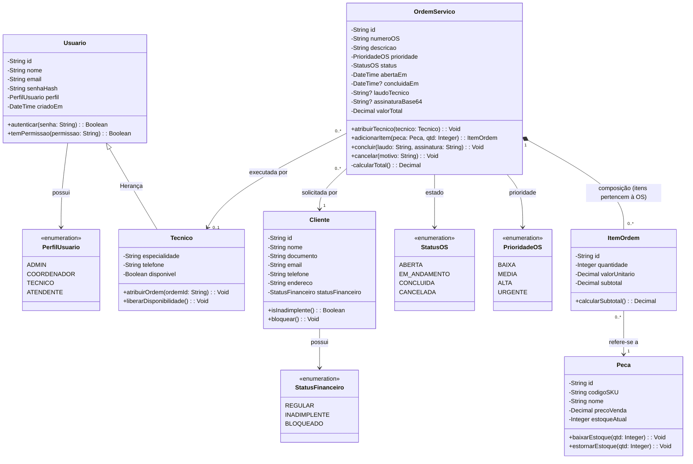
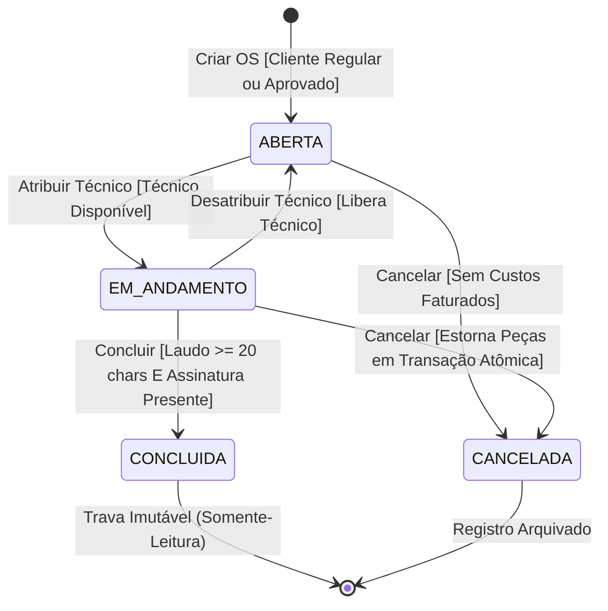

# 📐 Modelagem Estrutural & Comportamental (UML 2.5)

**Projeto:** [Nome do Projeto]  
**Referência SRS:** [thoughts/shared/requirements/YYYY-MM-DD-srs-specification.md]  
**Analista de Sistemas:** [Systems Analyst Agent]  
**Data:** [YYYY-MM-DD]  
**Versão:** 1.0.0  

---

## 🏗️ 1. Diagrama de Classes UML (Modelo Estrutural de Domínio)



---

## 🔄 2. Diagrama de Máquinas de Estado (Statechart do Ciclo de Vida da OS)



---

## ⚡ 3. Diagrama de Sequência de Sistema (SSD — Conclusão de OS)

```mermaid
sequenceDiagram
    autonumber
    actor T as 👤 Técnico de Campo
    participant UI as 📱 App Web / Mobile
    participant API as 🌐 Fastify API Controller
    participant Svc as ⚙️ WorkOrderService
    participant Repo as 🗄️ WorkOrderRepository
    participant DB as 💾 Database Transacional
    participant Mail as 📬 Email Service

    T->>UI: Preenche laudo conclusivo e coleta assinatura do cliente
    T->>UI: Clica em [Confirmar e Encerrar OS]
    
    UI->>API: POST /api/v1/orders/{id}/complete {laudo, assinatura}
    API->>Svc: completeOrder(orderId, laudo, assinatura, userContext)
    
    Svc->>Repo: findById(orderId)
    Repo->>DB: SELECT * FROM orders WHERE id = ?
    DB-->>Repo: Order Entity
    Repo-->>Svc: Order Entity
    
    alt Status != EM_ANDAMENTO
        Svc-->>API: Error 400 Bad Request ("OS não está em andamento")
        API-->>UI: Exibe alerta de estado inválido
    else Laudo < 20 caracteres OU Assinatura Vazia (RN-001)
        Svc-->>API: Error 422 Unprocessable Entity ("RN-001: Laudo e assinatura obrigatórios")
        API-->>UI: Destaca campos pendentes na tela
    else Validações Aprovadas
        Svc->>Svc: order.concluir(laudo, assinatura)
        Svc->>Repo: saveTransaction(order, items)
        Repo->>DB: BEGIN TRANSACTION; UPDATE orders SET status='CONCLUIDA'...; COMMIT;
        DB-->>Repo: Success
        Repo-->>Svc: Persisted Order
        
        Svc->>Mail: sendOrderReceiptAsync(order.id, client.email)
        Mail-->>Svc: Enqueued
        
        Svc-->>API: Order Completed DTO
        API-->>UI: HTTP 200 OK {orderId, status: "CONCLUIDA", receiptUrl}
        UI-->>T: Exibe toast de sucesso e comprovante em PDF
    end
```
