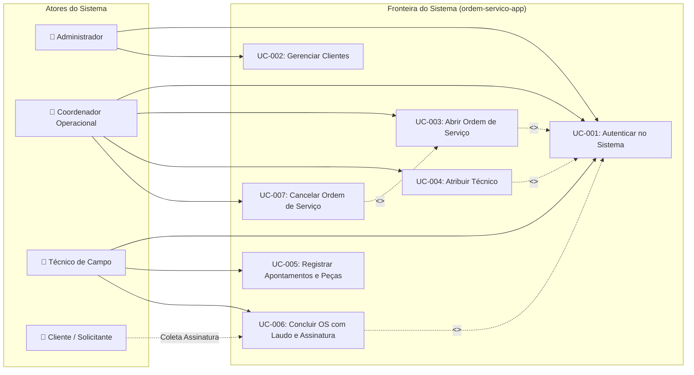

# 👥 Especificação de Casos de Uso (UML 2.5 Use Cases)

**Projeto:** [Nome do Projeto]  
**Referência SRS:** [thoughts/shared/requirements/YYYY-MM-DD-srs-specification.md]  
**Analista de Sistemas:** [Systems Analyst Agent]  
**Data:** [YYYY-MM-DD]  
**Versão:** 1.0.0  

---

## 🗺️ 1. Diagrama Geral de Casos de Uso (UML)

---

## 📝 2. Especificação Detalhada por Caso de Uso

---

### Caso de Uso: `UC-003 — Abrir Ordem de Serviço`

- **Identificador:** UC-003
- **Requisitos Associados:** RF-003, RNF-001, RNF-003
- **Regras de Negócio Vinculadas:** RN-002 (Inadimplência), RN-004 (Numeração Sequencial)
- **Ator Primário:** Coordenador Operacional / Atendente
- **Atores Secundários:** Sistema de Notificação
- **Pré-condições:** 
  1. O usuário deve estar autenticado com perfil `ATENDENTE`, `COORDENADOR` ou `ADMIN` (UC-001).
  2. O cliente deve estar previamente cadastrado e ativo na base (UC-002).
- **Pós-condições (Garantias de Sucesso):**
  1. A Ordem de Serviço é criada com status inicial `ABERTA`.
  2. O número sequencial contíguo é gerado e reservado no banco.
  3. Uma notificação é emitida para a fila de triagem.

#### Fluxo Principal (Happy Path):
1. O Atendente acessa a tela de Nova Ordem de Serviço.
2. O sistema exibe o formulário solicitando a seleção do cliente, descrição do defeito/serviço e prioridade.
3. O Atendente pesquisa e seleciona o cliente pelo nome ou documento.
4. O sistema valida se o cliente possui bloqueios cadastrais ou inadimplência (RN-002) e exibe os dados do cliente com status financeiro OK.
5. O Atendente preenche a descrição do problema relatado e define a prioridade (`BAIXA`, `MEDIA`, `ALTA`, `URGENTE`).
6. O Atendente clica no botão `[Salvar e Emitir Ordem]`.
7. O sistema valida a completude dos campos obrigatórios.
8. O sistema gera o número único de OS no formato `OS-YYYY-NNNNNN` (RN-004).
9. O sistema persiste o registro na base de dados com data/hora corrente e status `ABERTA`.
10. O sistema exibe mensagem de confirmação com o número da OS gerada e redireciona para a visualização detalhada.

#### Fluxos Alternativos:
- **FA-01: Cliente Não Encontrado na Busca:**
  1. No passo 3, o Atendente não localiza o cliente cadastrado.
  2. O sistema oferece o botão `[+ Cadastrar Novo Cliente Rapidamente]`.
  3. O Atendente aciona o fluxo de cadastro rápido (UC-002).
  4. Ao concluir, o novo cliente é pré-selecionado no formulário da OS e o fluxo principal é retomado a partir do passo 4.

#### Fluxos de Exceção:
- **FE-01: Cliente Inadimplente com Prioridade Urgente (RN-002):**
  1. No passo 4, o sistema identifica que o cliente possui débitos vencidos há mais de 30 dias.
  2. No passo 5, o Atendente seleciona prioridade `URGENTE`.
  3. O sistema bloqueia a submissão e exibe o alerta: *"Clientes inadimplentes não podem ter ordens URGENTES sem autorização gerencial (RN-002)"*.
  4. O sistema solicita senha de liberação de um usuário com perfil `GERENTE`.
  5. Se o gerente autorizar, o fluxo segue para o passo 6 gravando o log de auditoria da liberação; caso contrário, a prioridade deve ser alterada ou a emissão abortada.
- **FE-02: Queda de Conexão durante a Persistência:**
  1. No passo 9, ocorre falha de conexão com a base de dados.
  2. A transação sofre rollback atômico.
  3. O sistema exibe mensagem amigável: *"Não foi possível emitir a ordem no momento. Nenhum registro foi gravado. Tente novamente."*
  4. Os dados preenchidos no formulário são mantidos no frontend sem perda de digitação.

---

### Caso de Uso: `UC-006 — Concluir OS com Laudo e Assinatura`

- **Identificador:** UC-006
- **Requisitos Associados:** RF-006, RNF-003, RNF-005
- **Regras de Negócio Vinculadas:** RN-001 (Pré-requisito de Conclusão), RN-005 (Trava de Edição)
- **Ator Primário:** Técnico de Campo
- **Ator Secundário:** Cliente (Assinante presencial)
- **Pré-condições:** 
  1. A OS deve estar em status `EM_ANDAMENTO` atribuída ao técnico logado.
- **Pós-condições:** 
  1. Status alterado para `CONCLUIDA`.
  2. Registro torna-se somente-leitura imutável.
  3. Comprovante PDF é gerado e enviado por e-mail ao cliente.

#### Fluxo Principal (Happy Path):
1. O Técnico acessa os detalhes da OS em andamento no seu dispositivo móvel.
2. O Técnico clica em `[Finalizar Atendimento]`.
3. O sistema exibe o formulário de encerramento exigindo:
   - Laudo técnico do serviço executado.
   - Quadro de coleta de assinatura digital em canvas touch.
   - Anexação opcional de fotos do serviço pronto.
4. O Técnico preenche o laudo técnico detalhando as ações tomadas.
5. O Técnico apresenta a tela para o Cliente conferir e assinar no quadro de assinatura digital.
6. O Cliente assina com o dedo ou caneta stylus.
7. O Técnico clica em `[Confirmar e Encerrar OS]`.
8. O sistema valida se o laudo possui ao menos 20 caracteres e se a assinatura não está vazia (RN-001).
9. O sistema transiciona o status para `CONCLUIDA`, grava o timestamp de encerramento e bloqueia novas edições (RN-005).
10. O sistema gera o comprovante em PDF e dispara e-mail de confirmação para o cliente.

#### Fluxos de Exceção:
- **FE-01: Assinatura ou Laudo Ausentes (Violação de RN-001):**
  1. No passo 8, o laudo possui menos de 20 caracteres ou a assinatura está em branco.
  2. O sistema impede a finalização, realça os campos em vermelho e instrui: *"O laudo conclusivo e a assinatura do cliente são obrigatórios para encerramento (RN-001)"*.
  3. A OS permanece em status `EM_ANDAMENTO`.
