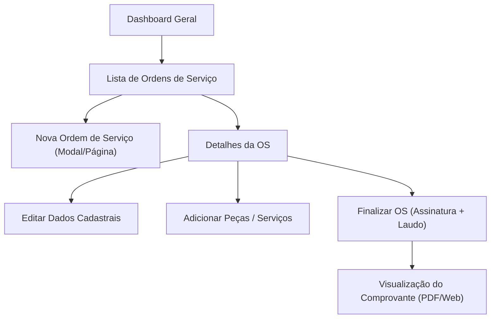

# 🗺️ User Experience (UX) & Journey Mapping Specification

**Feature / Product:** [e.g., Ordem de Serviço Lifecycle]  
**Linear Reference:** [ENG-XX: Title]  
**Author:** [Product Designer Agent]  
**Date:** [YYYY-MM-DD]  
**Status:** [Draft / Approved / In Implementation]  

---

## 👤 1. Primary User Personas

### Persona A: [e.g., Carlos, Técnico de Campo]
- **Role & Context:** Técnico de manutenção em campo acessando via tablet/celular.
- **Primary Goal:** Visualizar ordens do dia, atualizar status com 1 toque e anexar foto da OS.
- **Key Frustrations:** Conexão instável, telas lentas, formulários com muitos campos obrigatórios inúteis.
- **Accessibility Needs:** Alto contraste para leitura sob luz solar direta, botões de toque grandes (mínimo 44x44px).

### Persona B: [e.g., Mariana, Coordenadora de Operações]
- **Role & Context:** Gestora operando em desktop com múltiplos monitores.
- **Primary Goal:** Painel em tempo real com visão geral de status, alertas de SLA e atribuição em massa.
- **Key Frustrations:** Falta de filtros rápidos, exportação truncada, ausência de busca global.

---

## 🧭 2. End-to-End User Journey Map

| Etapa da Jornada | Ações do Usuário | Ponto de Contato (Touchpoint) | Estado Emocional | Risco de Fricção / Drop-off | Oportunidade UX & Design |
| :--- | :--- | :--- | :---: | :--- | :--- |
| **1. Descoberta & Triagem** | Acessa lista de ordens pendentes | Tabela / Kanban de OS | 😐 Neutro | Sobrecarga de dados sem ordenação | Filtros rápidos (`Minhas OS`, `Urgentes`) salvos na URL |
| **2. Início do Atendimento** | Clica para iniciar execução | Detalhes da OS (Mobile/Web) | 🙂 Confiante | Botão de ação primária escondido | CTA fixo inferior (*sticky footer action*) com feedback tátil |
| **3. Registro de Peças / Horas** | Adiciona itens e serviços | Modal ou Drawer lateral | 😟 Ansioso | Erro ao salvar sem conexão | Armazenamento local temporário (IndexedDB / LocalStorage) |
| **4. Finalização & Assinatura** | Coleta assinatura do cliente | Canvas de assinatura / Conclusão | 😄 Aliviado | Lentidão no upload do laudo | Upload assíncrono com barra de progresso e toast de sucesso |

---

## 🔀 3. Information Architecture & Navigation Flow

---

## 🎯 4. UX Acceptance Criteria (DoD)
- [ ] **Frictionless Action:** Nenhuma ação crítica deve exigir mais de 3 cliques a partir do dashboard.
- [ ] **Touch Target Size:** Todos os elementos interativos possuem área clicável mínima de 44x44px em telas móveis.
- [ ] **Accessibility (WCAG 2.1 AAA):** Relação de contraste mínima de 4.5:1 em textos normais e 3:1 em títulos grandes.
- [ ] **Instant Feedback:** Toda mutação assíncrona exibe estado de loading (<100ms) e toast de confirmação.
- [ ] **Progressive Disclosure:** Detalhes avançados e metadados secundários ficam em accordions recolhidos por padrão.
